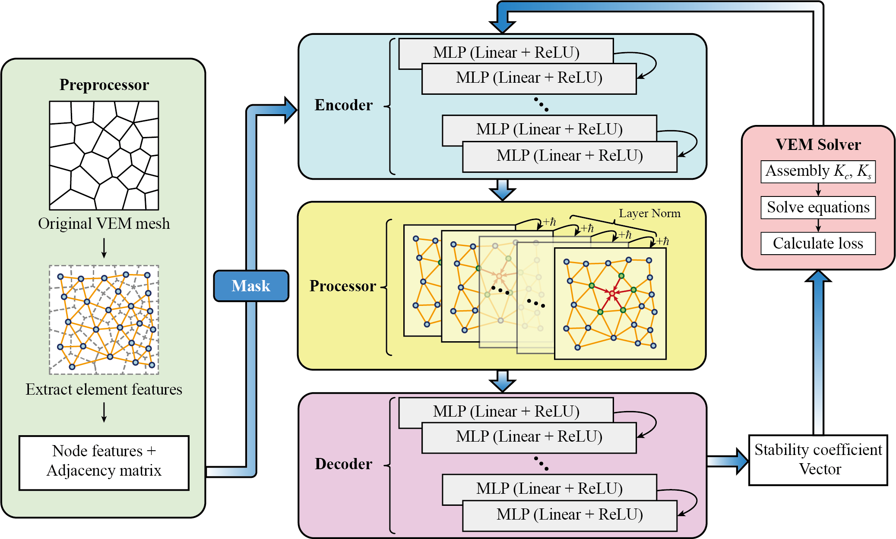

# GNE-VEM

Refrence paper: Graph Neural Network Enhanced Virtual Element Method: A Novel Framework for Improved Stability

Created on Dec 31 2025

@author: zrp22@mails.tsinghua.edu.cn, 2410254@tongji.edu.cn

This open-source code provides a graph neural network architecture that enhances the stability of VEM.

* ./src: Source code
* ./model: Trained model
* ./mesh: VEM mesh
* ./val: Generalization validation
* ./test: Applications to other problems

The VEM solver part is not included in this open-source repository and needs to be matched separately.
